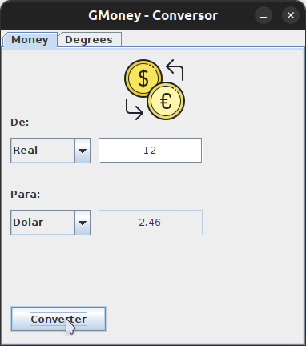
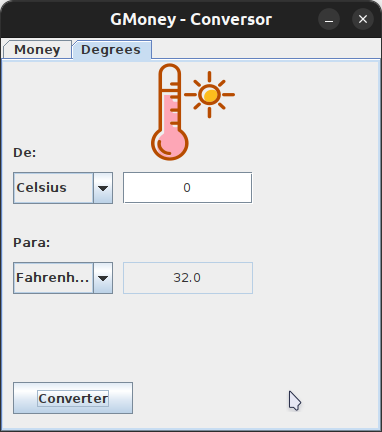

# Descrição

GMoney - Conversor é um conversor de moeda além de converter para alguns tipos de moeda como dólar e real, também e possível converter temperatura.

# Ferramentas Utilizadas

Ele foi criado inteiramente em java utilizado a biblioteca swing do mesmo, para ter sempre a catação das moedas atualizada foi utilizada a API Awesome para mas informações sobre a API aqui.

# Objetivo

A sua criação e totalmente educacional do projeto ONE - Oracle Next Education da Oracle com Alura.

# Como Executar

Existe uma versão em .jar empacota que e possível baixar [aqui](https://github.com/ygorfsguilherme/gmoney-conversor/releases) ou na opção realese do github.

_Obs: É necessário ter o java preferêncialmente 8 ou superior instalado para que funcione corretamente._

No terminal/cmd

```
java -jar gmoney-conversor.jar
```

<center></center>

<center></center>
